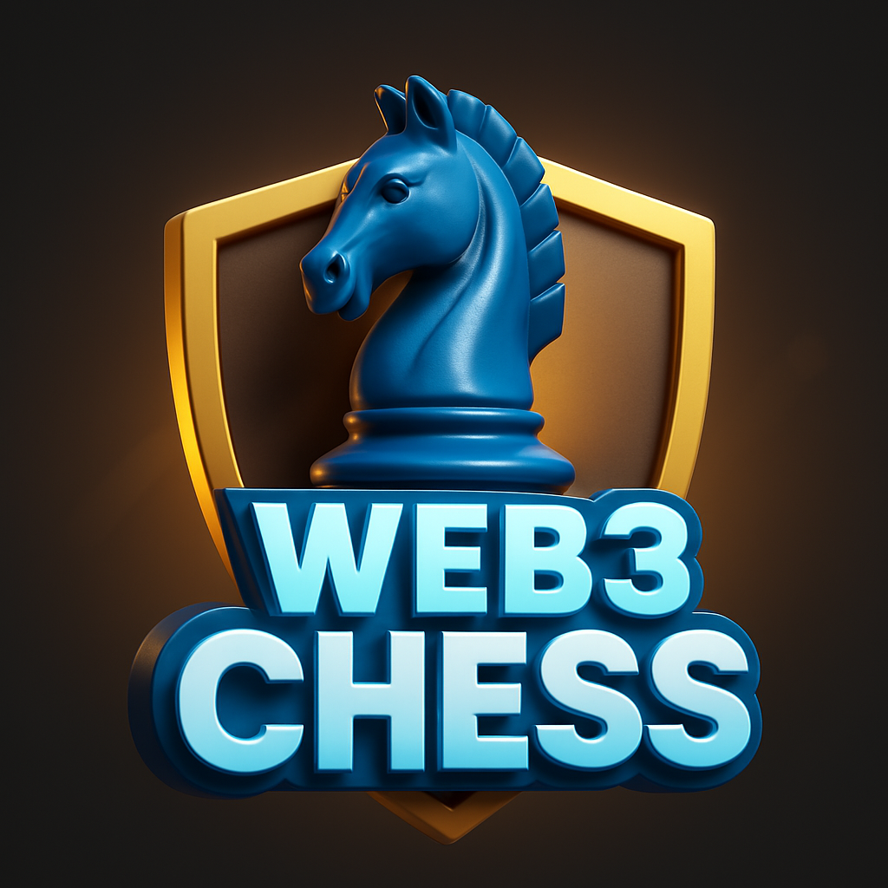

# ChessFi



## Play Chess. Bet Crypto. Win Big.

ChessFi is a revolutionary web3-based multiplayer chess platform where players can challenge each other and bet cryptocurrency on the outcome of their matches.


## ⚙️ Development

```bash
# Clone the repository
git clone https://github.com/gdevakrishnan/chessfi.git

# Install dependencies
cd chessfi
npm install

# Run development server
npm run dev
```

## 🤝 Contributing

We welcome contributions! Please see [CONTRIBUTING.md](CONTRIBUTING.md) for details.

## 📄 License

ChessFi is licensed under the MIT License - see the [LICENSE](LICENSE) file for details.